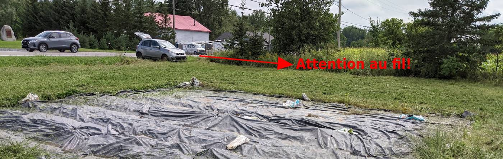
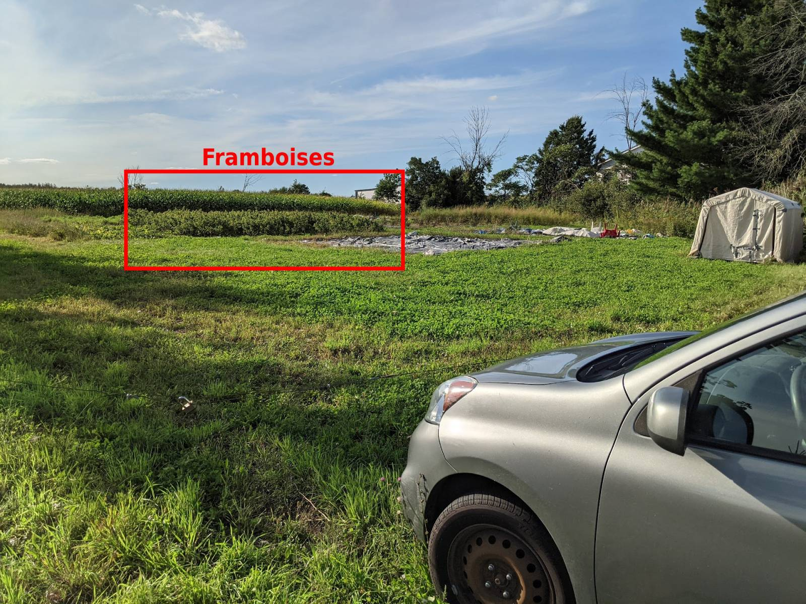
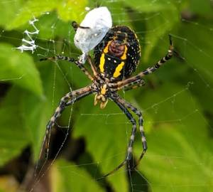
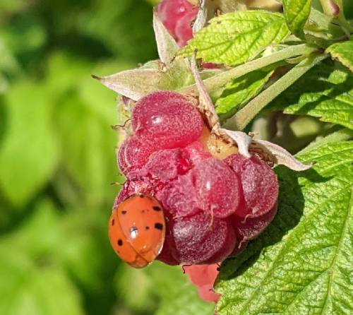

## Préparation
Portez des vêtements de travail (idéalement long), vous allez probablement écraser des framboises, c'est salissant!
Portez des bottes s'il a plu récemment (de l'eau, un chapeau et de la crème solaire pourraient être pertinents!).
Apportez plusieurs petits pots au lieu d'un grand pot. Ainsi, vous risquez moins d'écraser les framboises du dessous.

## Location
La terre se situe sur le chemin Sainte-Thérèse à Carignan devant le monument du fort Sainte-Thérèse (devant une grande maison rose).
**Attention**: à l'entrée, il y a un fil de fer qui "bloque" l'accès. Vous devez vous stationner juste avant (on peut y entrer deux véhicules au besoin).

```{=html}
<div class="map-responsive"><iframe src="https://www.google.com/maps/embed?pb=!1m18!1m12!1m3!1d585.490650913006!2d-73.26101217078177!3d45.39723499869374!2m3!1f0!2f0!3f0!3m2!1i1024!2i768!4f13.1!3m3!1m2!1s0x0%3A0x0!2zNDXCsDIzJzUwLjEiTiA3M8KwMTUnMzcuNyJX!5e1!3m2!1sfr!2sca!4v1623893218854!5m2!1sfr!2sca" width="500" height="300" style="border:0;" allowfullscreen="" loading="lazy"></iframe></div>
```





## Cueillette
Il est très important d'enlever toutes les framboises des plants, même si celles-ci ne sont pas jolies (elles attirent les ravageurs). Vous pouvez les lancer en dehors de la parcelle de framboises. De plus, il arrive souvent que certains morceaux de framboises restent en place, il est préférable de tout enlever.
Il y a beaucoup de vie dans les framboisiers. Avant de vous lancer sur des framboises, regarder bien pour qu'aucune guêpe ne soit en plein festin (ou au repos). Vous allez aussi remarquer de grosses araignées, elles sont nos amies; laissez-les tranquilles! 



## Coopération
Vous allez remarquer une forte présence de coccinelle. Aussi désagréable que ça puisse être, il faut les éliminer, car elles réduisent grandement le rendement. Les écraser par le côté est efficace. N'hésitez pas à éliminer les mouches, punaises ou tout insecte se trouvant sur les framboises, il faut contrôler leur population manuellement (nous n'utilisons aucun produit de synthèse).



Aussi, si jamais vous vous penchez pour ramasser des framboises et que vous voyez des mauvaises herbes, n'hésitez pas à les arracher! :)

Enfin, pour assurer un suivi sur la culture, ils seraient importants de connaître le poids de votre récolte.

Si vous ne pouvez pas tout cueillir, indiquer l'endroit qu'il reste à faire.

